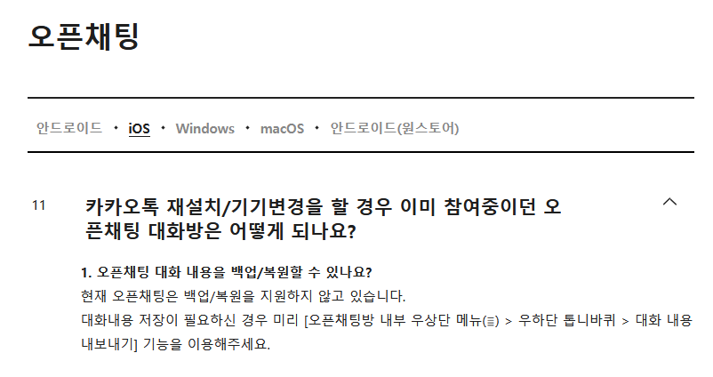

<!--
SPDX-FileCopyrightText: (C) 2022 Hong Yongmin (https://revi.xyz/) <yewon@revi.email>

SPDX-License-Identifier: LicenseRef-CC-BY-ND-2.0-KR
-->

# 오픈카톡 안 씁니다

> **1. 오픈채팅 대화 내용을 백업/복원할 수 있나요?**
>
> 현재 오픈채팅은 백업/복원을 지원하지 않고 있습니다.
>
> 대화내용 저장이 필요하신 경우 미리 [오픈채팅방 내부 우상단 메뉴(≣) > 우하단 톱니바퀴 > 대화 내용 내보내기] 기능을 이용해주세요.
>
> [출처](https://cs.kakao.com/helps?articleId=1073193470&service=8&category=105&device=9&locale=ko)

여러 기기 (컴퓨터, 노트북, 휴대전화, 아이패드 등) 이용 시 기기와 관계 없이 언제나 필요하면 채팅 내용을 복기하는 기능을 주요 기능으로
생각하기 때문에, 해당 기능이 존재하지 않는 오픈카톡을 사용하지 않습니다.

---

Screenshot in this page is not licensed under [site default image license](/meta#license).
