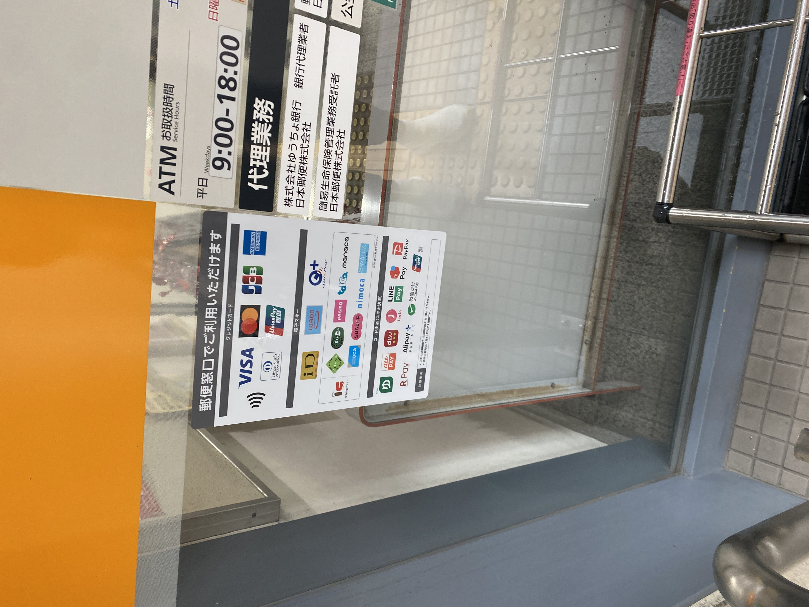

# 일본우정

해외 가면 집으로 편지 보내는 취미(?) 가 있는데, 설마 IC교통카드 되겠어~ 하고 마음의 준비를 하고 들어가는데... 교통카드가 된다? 일본이? 이걸...?

<!--truncate-->

(정오 비행기인데 10시 50분쯤에 공항 도착하는 바람에 환전이고 뭐고 할 시간 없이 바로 짐 쏘고 바로 탑승구로 달려갔음... 그 후로는 애플페이의 Suica로 연명하고 있었음.)
